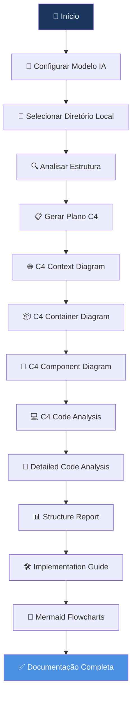

# 🚀 Skyone DocAgent v3.0

**Plataforma Avançada de Análise e Documentação Automática com Arquitetura C4**

Skyone DocAgent v3.0 é uma solução completa para análise automatizada de projetos de código, gerando documentação técnica abrangente usando tecnologias de ponta como LangGraph, OpenAI/Ollama e modelo C4.

## ✨ Principais Funcionalidades

### 🤖 **LangGraph Multi-Agent Analysis**
- Sistema multi-agente baseado em LangGraph
- Análise colaborativa entre agentes especializados
- Documentação técnica detalhada e precisa
- Suporte a múltiplas linguagens de programação

### 🏗️ **C4 Model Documentation**
- Documentação arquitetural seguindo o padrão C4
- Diagramas de Contexto, Contêiner, Componente e Código
- Integração com Mermaid para visualizações profissionais
- Análise automática de tecnologias e dependências

### 🔬 **Análise Técnica Detalhada**
- Análise linha por linha de código
- Relatório estrutural profundo
- Guia técnico de implementação
- Fluxogramas Mermaid separados

### 📊 **Interface Web Moderna**
- Dashboard responsivo com cores Skyone
- Análise em tempo real com progresso das 8 etapas
- Download automático de documentação
- Interface intuitiva e amigável

### 🧠 **Suporte Multi-LLM**
- OpenAI GPT-4o, GPT-4 Turbo, GPT-3.5 Turbo
- Ollama local com detecção automática de modelos
- Configuração flexível de modelos de IA
- Fallbacks inteligentes para máxima compatibilidade

### 🏗️ Arquitetura do Sistema



## 🛠️ **Tecnologias**

- **Backend**: Python 3.8+, FastAPI, LangGraph, Pydantic
- **AI/ML**: LangGraph, OpenAI GPT-4, Ollama Local
- **Frontend**: HTML5, Tailwind CSS, JavaScript
- **Documentation**: Markdown, Mermaid, C4 Model
- **Integration**: Playwright, Chart Generation

## 📋 **Pré-requisitos**

- Python 3.8 ou superior
- Git instalado no sistema
- Conexão com internet para APIs
- (Opcional) OpenAI API Key para modelos GPT
- (Opcional) Ollama instalado para modelos locais

## 🚀 **Instalação**

### 1. Clone o Repositório
```bash
git clone https://github.com/skyone/docagent-v3.git
cd agents
```

### 2. Instale as Dependências
```bash
pip install -r requirements.txt
```

### 3. Configure as Variáveis de Ambiente (Opcional)
```bash
# Para funcionalidades OpenAI
export OPENAI_API_KEY="sua_api_key_openai"

# Para repositórios privados do GitHub
export GITHUB_TOKEN="seu_token_github"

# Para Ollama (alternativa local)
export OLLAMA_MODEL="qwen2.5:7b"
```

### 4. Execute a Aplicação
```bash
python3 Docagent_Skyone.py
```

### 5. Acesse a Interface Web
Abra seu navegador e acesse: `http://localhost:8001`

## 📖 **Como Usar**

### 1. **Configuração de Modelo**
- Selecione entre OpenAI GPT ou Ollama local
- Configure API Key do OpenAI (se aplicável)
- Clique "Atualizar Lista" para carregar modelos Ollama
- Teste a conexão com o modelo selecionado

### 2. **Análise de Projeto**
- Insira o caminho do diretório local do projeto
- Escolha entre análise com ou sem anonimização
- Configure parâmetros de análise se necessário
- Inicie a análise e acompanhe o progresso das 8 etapas

### 3. **Documentação Gerada**
A análise produz os seguintes arquivos:

#### **Documentação C4 Model**
- `01_C4_Context_Diagram.md` - Diagrama de contexto
- `02_C4_Container_Diagram.md` - Diagrama de contêineres
- `03_C4_Component_Diagram.md` - Diagrama de componentes
- `04_C4_Code_Analysis.md` - Análise de código C4

#### **Análise Técnica Detalhada**
- `05_Detailed_Code_Analysis.md` - Análise linha por linha
- `06_Code_Structure_Report.md` - Relatório estrutural
- `07_Technical_Implementation_Guide.md` - Guia de implementação
- `08_Mermaid_Flowcharts.md` - Fluxogramas detalhados

### 4. **Download dos Arquivos**
- Download individual de cada arquivo
- Download em lote (ZIP) de toda a documentação
- Suporte a modo anônimo para relatórios sem identificação
- Chart visual do workflow LangGraph

## ⚙️ **Configuração**

### **Configuração de Modelos**
Configure através da interface web:
1. Acesse "Modelo de IA"
2. Selecione "OpenAI GPT" ou "Ollama Local"
3. Para OpenAI: Insira API Key
4. Para Ollama: Clique "Atualizar Lista" para carregar modelos
5. Teste a conexão

### **Diretório Local**
Configure o projeto a ser analisado:
```bash
# Exemplo de caminho
/home/usuario/meu-projeto
/Users/usuario/Documents/projeto
C:\Users\usuario\projeto
```

### **LangGraph Configuration**
O sistema detecta automaticamente:
- OpenAI API (via variável de ambiente)
- Ollama (se instalado localmente)
- Playwright (para geração de charts)


## 🔌 **API Endpoints**

### **Modelo de IA**
- `GET /api/models/available` - Listar modelos OpenAI e Ollama
- `POST /api/configure-model` - Configurar modelo ativo
- `POST /api/test-model` - Testar conexão com modelo

### **Análise**
- `POST /api/analyze` - Iniciar análise C4 + Detalhada
- `GET /api/status` - Status da análise em tempo real
- `GET /api/results` - Resultados da análise

### **Downloads**
- `GET /api/download/{filename}` - Download de arquivo específico
- `GET /api/download-all-zip` - Download de todos os arquivos (ZIP)
- `GET /api/generate-mermaid-chart` - Chart visual do workflow

### **Logs**
- `GET /health` - Health check do sistema
- `GET /docs` - Documentação automática da API

## 🏗️ **Arquitetura do Sistema**

```
┌─────────────────┐    ┌─────────────────┐    ┌─────────────────┐
│   Frontend      │    │   Backend       │    │   External      │
│   (Web UI)      │◄──►│   (FastAPI)     │◄──►│   (OpenAI/Ollama)│
└─────────────────┘    └─────────────────┘    └─────────────────┘
                                │
                       ┌─────────────────┐
                       │  LangGraph      │
                       │  (Agents)       │
                       └─────────────────┘
                                │
                       ┌─────────────────┐
                       │  C4 + Analysis  │
                       │  (Documentation)│
                       └─────────────────┘
```

## 📁 **Estrutura do Projeto**

```
skyone-docagent/
├── Docagent_Skyone.py      # Aplicação principal
├── config.py               # Configurações
├── templates/
│   └── index.html         # Interface web
├── static/                # Arquivos estáticos
├── docs/                  # Documentação gerada
├── workdir/              # Diretório de trabalho
├── logs/                 # Logs do sistema
├── requirements.txt       # Dependências Python
└── README.md             # Este arquivo
```

## 🔧 **Desenvolvimento**

### **Executar em Modo Debug**
```bash
DEBUG=True python3 Docagent_Skyone.py
```

### **Executar Testes**
```bash
python -m pytest tests/
```

### **Linting**
```bash
flake8 Docagent_Skyone.py
black Docagent_Skyone.py
```

## 🤝 **Contribuindo**

1. Faça um fork do projeto
2. Crie uma branch para sua feature (`git checkout -b feature/NovaFuncionalidade`)
3. Commit suas mudanças (`git commit -m 'Adiciona nova funcionalidade'`)
4. Push para a branch (`git push origin feature/NovaFuncionalidade`)
5. Abra um Pull Request

## 📝 **Licença**

Este projeto está licenciado sob a Licença MIT - veja o arquivo [LICENSE](LICENSE) para detalhes.

## 🐛 **Reportar Bugs**

Encontrou um bug? Abra uma [issue](https://github.com/skyone/docagent-v3/issues) com:
- Descrição detalhada do problema
- Passos para reproduzir
- Ambiente (SO, Python version, etc.)
- Logs de erro (se aplicável)

## 💡 **Roadmap**

### **Próximas Funcionalidades**
- [ ] Suporte a GitLab e Bitbucket
- [ ] Análise de dependências e vulnerabilidades
- [ ] Integração com ferramentas de CI/CD
- [ ] API GraphQL
- [ ] Análise de performance de código
- [ ] Geração de testes automatizados
- [ ] Suporte a mais modelos de LLM

### **Melhorias Planejadas**
- [ ] Cache inteligente de análises
- [ ] Análise incremental
- [ ] Dashboard de métricas
- [ ] Notificações em tempo real
- [ ] Exportação para outros formatos (PDF, DOCX)

## 📞 **Suporte**

- **Documentação**: [Wiki do Projeto](https://github.com/skyone/docagent-v3/wiki)
- **Issues**: [GitHub Issues](https://github.com/skyone/docagent-v3/issues)
- **Interface**: `http://localhost:8001`
- **API Docs**: `http://localhost:8001/docs`

## 🏆 **Créditos**

- **LangGraph Framework**: LangChain Team
- **C4 Model**: Simon Brown
- **FastAPI**: Sebastian Ramirez
- **Tailwind CSS**: Tailwind Labs
- **Mermaid**: Mermaid Team

## 📊 **Status do Projeto**


---

**Skyone DocAgent v3.0** - Transformando código em documentação profissional automaticamente 🚀

*Desenvolvido com ❤️ pela equipe Skyone para a comunidade de desenvolvedores*
