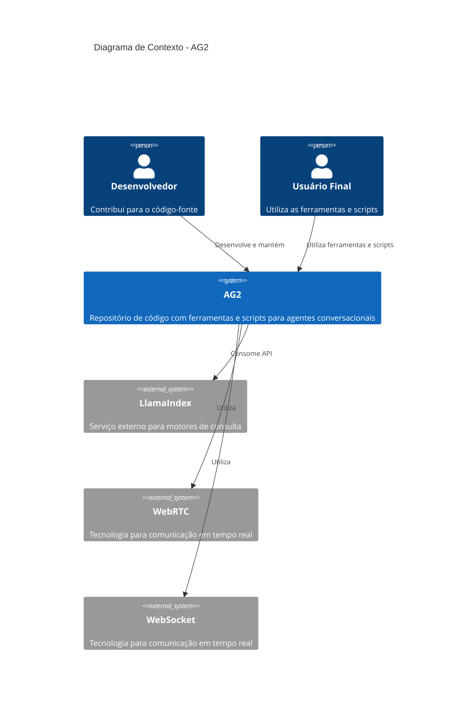

# C4 Context Diagram

## 🎯 Visão Contextual do Sistema

### Sistema Principal
O sistema principal é um repositório de código que contém principalmente arquivos Python e alguns arquivos JavaScript. Ele parece ser uma coleção de ferramentas e scripts relacionados a agentes conversacionais, avaliação de agentes, e integrações com serviços externos como LlamaIndex.

### Usuários e Atores
- **Desenvolvedores**: Pessoas que contribuem para o código-fonte do projeto.
- **Usuários Finais**: Pessoas que utilizam as ferramentas e scripts fornecidos pelo sistema para suas próprias necessidades.

### Sistemas Externos
- **LlamaIndex**: Serviço externo utilizado para motores de consulta e agentes conversacionais.
- **WebRTC e WebSocket**: Tecnologias utilizadas para comunicação em tempo real nos notebooks de agentchat.

### Interações Principais
O sistema se comunica com o mundo externo principalmente através de APIs e serviços como LlamaIndex, além de utilizar tecnologias de comunicação em tempo real como WebRTC e WebSocket.

## 📊 Diagrama de Contexto C4

## 🔗 Integrações Identificadas
- **LlamaIndex**: Utilizado para motores de consulta e agentes conversacionais.
- **WebRTC**: Utilizado para comunicação em tempo real nos notebooks de agentchat.
- **WebSocket**: Utilizado para comunicação em tempo real nos notebooks de agentchat.