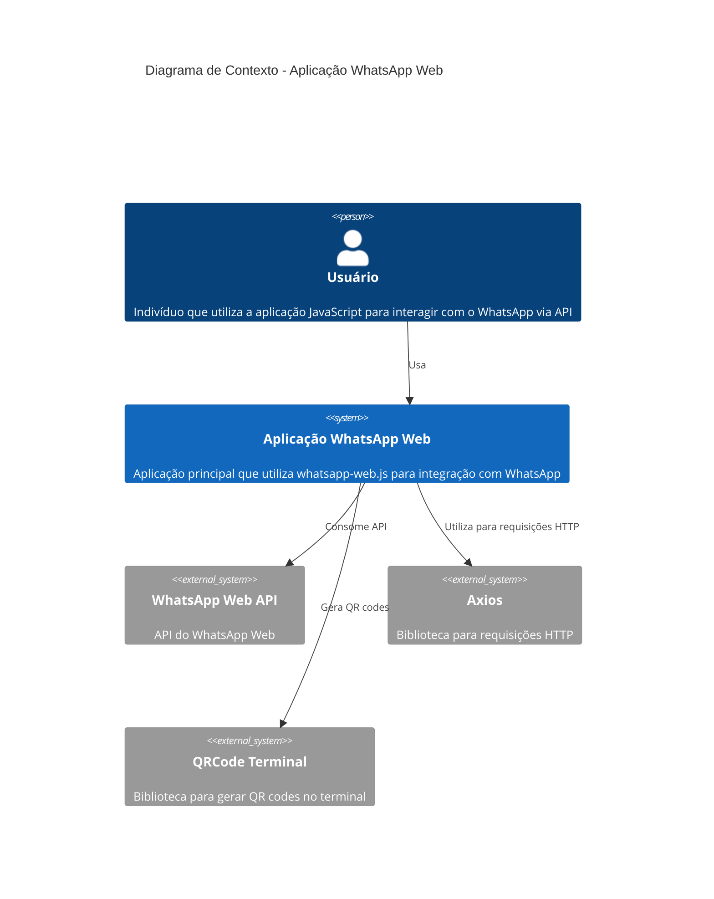

# C4 Context Diagram

## 🎯 Visão Contextual do Sistema

### Sistema Principal
O sistema principal é uma aplicação JavaScript que utiliza o `whatsapp-web.js` para interagir com a API do WhatsApp Web. O propósito principal parece ser a automação ou integração de funcionalidades relacionadas ao WhatsApp.

### Usuários e Atores
- **Usuário**: Indivíduo que utiliza a aplicação JavaScript para interagir com o WhatsApp via API.

### Sistemas Externos
- **WhatsApp Web API**: Aplicação principal que permite a integração com o serviço de mensagens do WhatsApp.
- **Axios**: Biblioteca para fazer requisições HTTP, provavelmente utilizada para comunicação com APIs externas.
- **QRCode Terminal**: Biblioteca para gerar QR codes no terminal, possivelmente usada para autenticação ou configuração inicial.

### Interações Principais
O sistema principal interage diretamente com a API do WhatsApp Web através da biblioteca `whatsapp-web.js`. Ele também utiliza Axios para fazer requisições HTTP e QRCode Terminal para gerar códigos QR no terminal.

## 📊 Diagrama de Contexto C4

## 🔗 Integrações Identificadas
- **WhatsApp Web API**: Utilizada pela aplicação principal para interagir com o serviço de mensagens do WhatsApp.
- **Axios**: Biblioteca utilizada para fazer requisições HTTP, provavelmente para comunicação com APIs externas.
- **QRCode Terminal**: Biblioteca utilizada para gerar QR codes no terminal, possivelmente para autenticação ou configuração inicial.