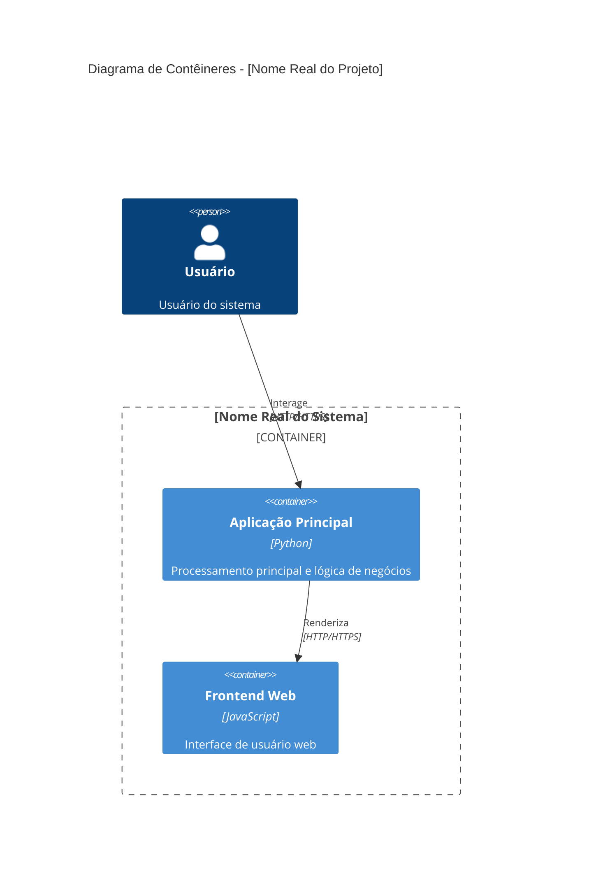

# C4 Container Diagram

## 🏗️ Arquitetura de Contêineres Reais

### Contêineres Identificados na Análise
[Baseado na estrutura de diretórios REAL: frontend/, backend/, api/, etc.]

### Stack Tecnológico Real
[APENAS as tecnologias REAIS das dependências:]
- **Linguagens:** Python (99.1%), JavaScript (0.9%)
- **Frameworks e Bibliotecas:**
  - Poetry (gerenciamento de pacotes)
  - BeautifulSoup, requests, chromadb, markdownify, pypdf, tiktoken, PIL

### Comunicação e Protocolos
[Baseado nos imports e configurações REAIS encontrados]

## 📦 Diagrama de Contêineres C4 (Dados Reais)

## 🔧 Detalhes Técnicos dos Contêineres Reais

### Aplicação Principal
- **Tecnologia:** Python
- **Localização:** Diretório principal do projeto (autogen/)
- **Responsabilidades:**
  - Processamento de dados
  - Lógica de negócios
  - Integração com bibliotecas externas
- **Dependências:**
  - BeautifulSoup, requests, chromadb, markdownify, pypdf, tiktoken, PIL
- **Configuração:** Arquivos de configuração em `pyproject.toml`

### Frontend Web
- **Tecnologia:** JavaScript
- **Localização:** Diretório `notebook/agentchat_realtime_websocket/static/main.js`
- **Responsabilidades:**
  - Interface de usuário web
  - Comunicação com a aplicação principal via HTTP/HTTPS

## 🌐 Integrações Externas Reais
[APENAS se identificadas nas dependências ou imports:]

IMPORTANTE: Use SOMENTE dados REAIS da análise. NÃO invente contêineres, bancos de dados ou APIs.