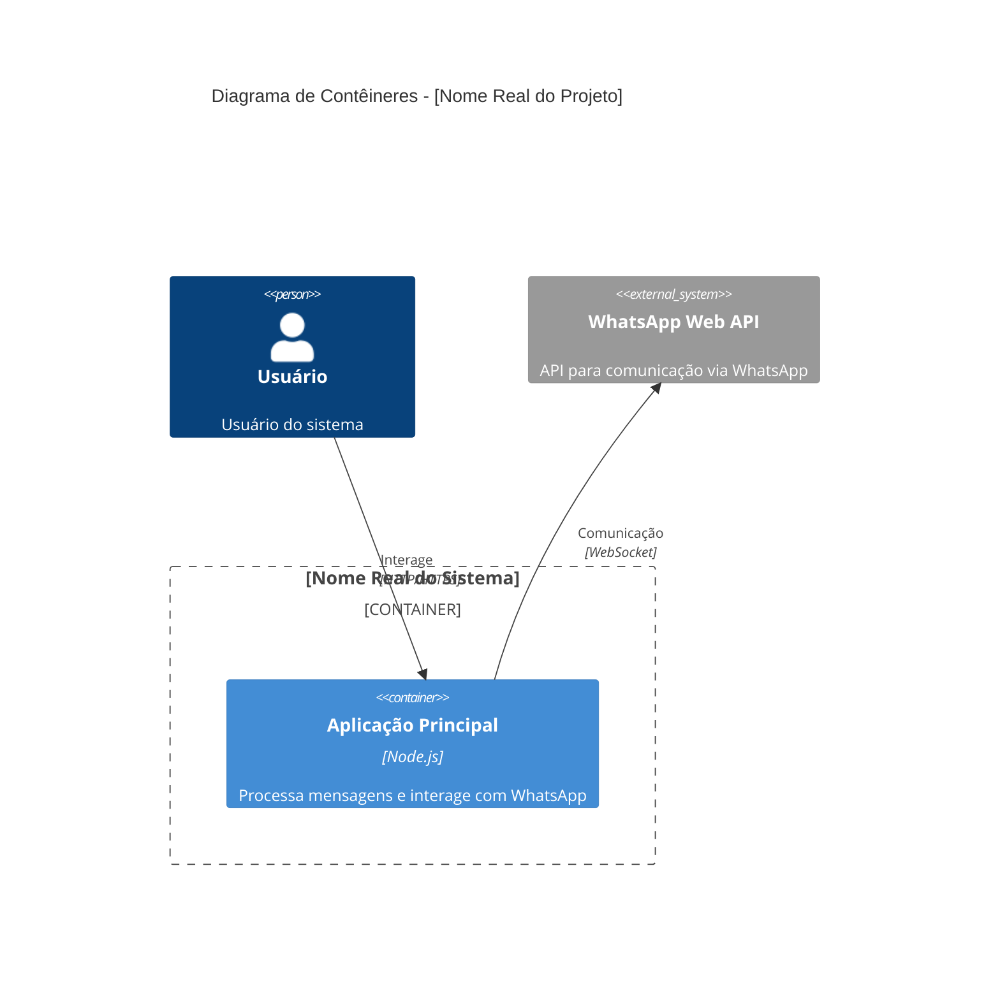

# C4 Container Diagram

## 🏗️ Arquitetura de Contêineres Reais

### Contêineres Identificados na Análise
[Baseado na estrutura de diretórios REAL: frontend/, backend/, api/, etc.]

### Stack Tecnológico Real
[APENAS as tecnologias REAIS das dependências:]
- **Linguagens:** JavaScript
- **Frameworks:** whatsapp-web.js
- **Bibliotecas:** axios, qrcode-terminal

### Comunicação e Protocolos
[Baseado nos imports e configurações REAIS encontrados]

## 📦 Diagrama de Contêineres C4 (Dados Reais)

## 🔧 Detalhes Técnicos dos Contêineres Reais

### Aplicação Principal
- **Tecnologia:** Node.js
- **Localização:** Diretório principal (onde está index.js)
- **Responsabilidades:** Processa mensagens e interage com WhatsApp
- **Dependências:**
  - axios: ^1.7.2
  - qrcode-terminal: ^0.12.0
  - whatsapp-web.js: github:pedroslopez/whatsapp-web.js#webpack-exodus
- **Configuração:** package.json

## 🌐 Integrações Externas Reais
- **WhatsApp Web API**: Utilizada para comunicação via WhatsApp através do framework whatsapp-web.js.

IMPORTANTE: Use SOMENTE dados REAIS da análise. NÃO invente contêineres, bancos de dados ou APIs.