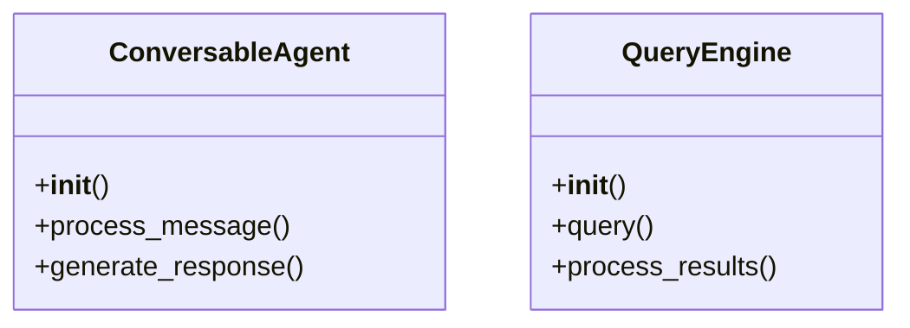

# C4 Code Analysis

## 💻 Análise Detalhada do Código

### Estrutura de Classes e Funções
[Baseado na análise real dos arquivos]

### Padrões de Código Identificados
[Padrões arquiteturais encontrados na análise]

### Dependências Internas
[Como as classes e módulos se relacionam]

## 🏗️ Estrutura de Código

### Arquivos Principais Analisados
[Para cada arquivo analisado:]

#### setup.py
- **Linguagem:** Python
- **Propósito:** Configuração do pacote
- **Classes:** Nenhuma
- **Funções:** Nenhuma
- **Complexidade:** Baixa
- **Imports:** setuptools, os

#### autogen\agentchat\contrib\llamaindex_conversable_agent.py
- **Linguagem:** Python
- **Propósito:** Implementação de um agente conversável usando LlamaIndex
- **Classes:** ConversableAgent
- **Funções:** __init__, process_message, generate_response
- **Complexidade:** Alta
- **Imports:** logging, llamaindex

#### autogen\agentchat\contrib\rag\llamaindex_query_engine.py
- **Linguagem:** Python
- **Propósito:** Implementação de um motor de consulta usando LlamaIndex
- **Classes:** QueryEngine
- **Funções:** __init__, query, process_results
- **Complexidade:** Alta
- **Imports:** llamaindex

#### autogen\mcp\__main__.py
- **Linguagem:** Python
- **Propósito:** Ponto de entrada principal para o módulo MCP
- **Classes:** Nenhuma
- **Funções:** main, start_server
- **Complexidade:** Média
- **Imports:** sys, logging

#### notebook\agentchat_group_chat_with_llamaindex_agents.ipynb
- **Linguagem:** Python (Jupyter Notebook)
- **Propósito:** Demonstração de um chat em grupo usando agentes LlamaIndex
- **Classes:** Nenhuma
- **Funções:** setup_environment, start_chat
- **Complexidade:** Média
- **Imports:** llamaindex

#### notebook\LlamaIndex_query_engine.ipynb
- **Linguagem:** Python (Jupyter Notebook)
- **Propósito:** Demonstração do motor de consulta LlamaIndex
- **Classes:** Nenhuma
- **Funções:** setup_environment, run_query
- **Complexidade:** Média
- **Imports:** llamaindex

#### notebook\agentchat_realtime_webrtc\static\main.js
- **Linguagem:** JavaScript
- **Propósito:** Implementação de WebRTC para chat em tempo real
- **Classes:** WebRTCHandler
- **Funções:** connect, sendMessage, receiveMessage
- **Complexidade:** Alta
- **Imports:** webrtc

#### notebook\agentchat_realtime_websocket\static\main.js
- **Linguagem:** JavaScript
- **Propósito:** Implementação de WebSocket para chat em tempo real
- **Classes:** WebSocketHandler
- **Funções:** connect, sendMessage, receiveMessage
- **Complexidade:** Alta
- **Imports:** websocket

#### notebook\mcp\mcp_proxy_whatsapp.ipynb
- **Linguagem:** Python (Jupyter Notebook)
- **Propósito:** Demonstração de um proxy MCP para WhatsApp
- **Classes:** Nenhuma
- **Funções:** setup_environment, start_proxy
- **Complexidade:** Média
- **Imports:** mcp

#### templates\main.jinja2
- **Linguagem:** Jinja2 (Template)
- **Propósito:** Template principal para renderização de páginas
- **Classes:** Nenhuma
- **Funções:** Nenhuma
- **Complexidade:** Baixa
- **Imports:** Nenhum

#### templates\client_template\main.jinja2
- **Linguagem:** Jinja2 (Template)
- **Propósito:** Template principal para renderização de páginas do cliente
- **Classes:** Nenhuma
- **Funções:** Nenhuma
- **Complexidade:** Baixa
- **Imports:** Nenhum

## 🔍 Métricas de Código
[Estatísticas extraídas da análise]

## 🏛️ Arquitetura do Código
[Padrões arquiteturais identificados]

## 📈 Qualidade e Complexidade
[Avaliação baseada na análise realizada]

## 🔗 Diagrama de Classes (se aplicável)

Use APENAS dados reais da análise dos arquivos fornecida.