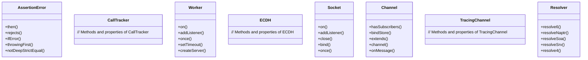

# C4 Code Analysis

## 💻 Análise Detalhada do Código

### Estrutura de Classes e Funções

#### 1. index.js (JavaScript)
- **Localização:** `index.js`
- **Tamanho:** 1,572 bytes | **Linhas:** 50
- **Complexidade:** Média
- **Propósito:** Ponto de entrada da aplicação
- **Funções:**
  - fetchResponses
  - on
  - async

#### 2. moduleraid.js (JavaScript)
- **Localização:** `node_modules\@pedroslopez\moduleraid\moduleraid.js`
- **Tamanho:** 1,792 bytes | **Linhas:** 61
- **Complexidade:** Média
- **Propósito:** Arquivo JavaScript do projeto
- **Funções:**
  - get
  - findModule

#### 3. assert.d.ts (TypeScript)
- **Localização:** `node_modules\@types\node\assert.d.ts`
- **Tamanho:** 43,823 bytes | **Linhas:** 1,040
- **Complexidade:** Alta
- **Propósito:** Arquivo TypeScript do projeto
- **Funções:**
  - then
  - rejects
  - ifError
  - throwingFirst
  - notDeepStrictEqual e mais 5
- **Classes:**
  - AssertionError
  - CallTracker
- **Principais imports:**
  - node:assert
  - node:assert/strict

#### 4. async_hooks.d.ts (TypeScript)
- **Localização:** `node_modules\@types\node\async_hooks.d.ts`
- **Tamanho:** 23,283 bytes | **Linhas:** 541
- **Complexidade:** Alta
- **Propósito:** Arquivo TypeScript do projeto
- **Funções:**
  - on
  - someFunction
  - addListener
  - once
  - setTimeout e mais 4
- **Classes:**
  - Worker
- **Principais imports:**
  - node:cluster
  - node:http
  - node:os
  - node:process
  - node:child_process

#### 5. console.d.ts (TypeScript)
- **Localização:** `node_modules\@types\node\console.d.ts`
- **Tamanho:** 21,246 bytes | **Linhas:** 452
- **Complexidade:** Alta
- **Propósito:** Arquivo TypeScript do projeto
- **Classes:**
  - with
- **Principais imports:**
  - node:util

#### 6. constants.d.ts (TypeScript)
- **Localização:** `node_modules\@types\node\constants.d.ts`
- **Tamanho:** 623 bytes | **Linhas:** 17
- **Complexidade:** Baixa
- **Propósito:** Arquivo TypeScript do projeto
- **Principais imports:**
  - node:os
  - node:crypto
  - node:fs

#### 7. crypto.d.ts (TypeScript)
- **Localização:** `node_modules\@types\node\crypto.d.ts`
- **Tamanho:** 193,200 bytes | **Linhas:** 4,522
- **Complexidade:** Alta
- **Propósito:** Arquivo TypeScript do projeto
- **Funções:**
  - scryptSync
  - on
  - generateKeyPairSync
  - getFips
  - publicEncrypt e mais 5
- **Classes:**
  - ECDH
  - takes
  - for e mais 7
- **Principais imports:**
  - node:stream
  - node:tls
  - node:buffer
  - node:process
  - node:fs

#### 8. dgram.d.ts (TypeScript)
- **Localização:** `node_modules\@types\node\dgram.d.ts`
- **Tamanho:** 27,773 bytes | **Linhas:** 596
- **Complexidade:** Alta
- **Propósito:** Arquivo TypeScript do projeto
- **Funções:**
  - on
  - addListener
  - close
  - bind
  - once e mais 5
- **Classes:**
  - Socket
- **Principais imports:**
  - node:dgram
  - node:net
  - node:dns
  - node:events
  - node:cluster

#### 9. diagnostics_channel.d.ts (TypeScript)
- **Localização:** `node_modules\@types\node\diagnostics_channel.d.ts`
- **Tamanho:** 24,065 bytes | **Linhas:** 554
- **Complexidade:** Alta
- **Propósito:** Arquivo TypeScript do projeto
- **Funções:**
  - hasSubscribers
  - bindStore
  - extends
  - channel
  - onMessage e mais 5
- **Classes:**
  - Channel
  - TracingChannel
- **Principais imports:**
  - node:diagnostics_channel
  - node:async_hooks

#### 10. dns.d.ts (TypeScript)
- **Localização:** `node_modules\@types\node\dns.d.ts`
- **Tamanho:** 35,604 bytes | **Linhas:** 864
- **Complexidade:** Alta
- **Propósito:** Arquivo TypeScript do projeto
- **Funções:**
  - resolve6
  - resolveNaptr
  - resolveSoa
  - resolveSrv
  - resolve4 e mais 5
- **Classes:**
  - Resolver
- **Principais imports:**
  - node:dns/promises

#### 11. dom-events.d.ts (TypeScript)
- **Localização:** `node_modules\@types\node\dom-events.d.ts`
- **Tamanho:** 5,871 bytes | **Linhas:** 114
- **Complexidade:** Baixa
- **Propósito:** Arquivo TypeScript do projeto
- **Principais imports:**
  - events

#### 12. domain.d.ts (TypeScript)
- **Localização:** `node_modules\@types\node\domain.d.ts`
- **Tamanho:** 7,825 bytes | **Linhas:** 170
- **Complexidade:** Alta
- **Propósito:** Arquivo TypeScript do projeto
- **Funções:**
  - on
  - setTimeout
  - nextTick
  - readSomeFile
  - create e mais 3
- **Classes:**
  - encapsulates
  - Domain

### Padrões de Código Identificados
[Padrões arquiteturais encontrados na análise]

### Dependências Internas
[Como as classes e módulos se relacionam]

## 🏗️ Estrutura de Código

### Arquivos Principais Analisados

#### index.js
- **Linguagem:** JavaScript
- **Propósito:** Ponto de entrada da aplicação
- **Funções:**
  - fetchResponses
  - on
  - async
- **Complexidade:** Média
- **Imports:** [Dependências identificadas]

## 🔍 Métricas de Código

### Estatísticas Gerais:
- **Total de arquivos:** 4
- **Arquivos de código:** 1
- **Linguagens detectadas:** 1

### Distribuição por Linguagem:
- **JavaScript:** 1 arquivo (100.0%)

## 🏛️ Arquitetura do Código

[Padrões arquiteturais identificados]

## 📈 Qualidade e Complexidade

[Avaliação baseada na análise realizada]

## 🔗 Diagrama de Classes (se aplicável)

Use APENAS dados reais da análise dos arquivos fornecida.